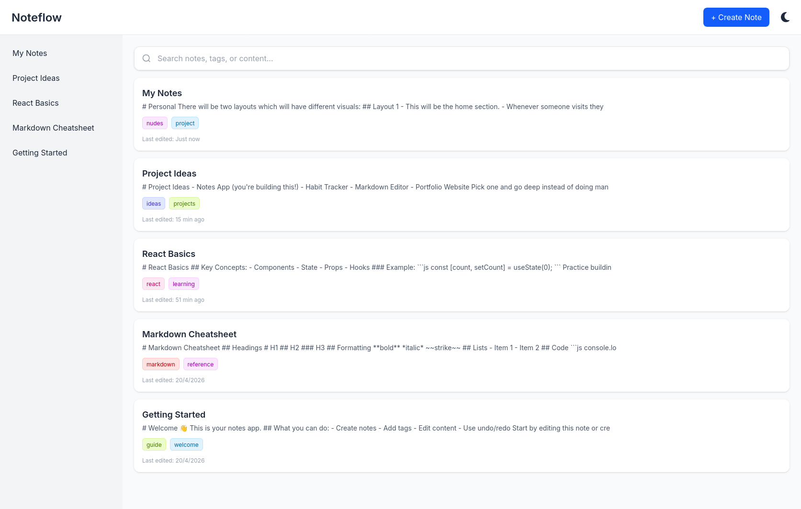
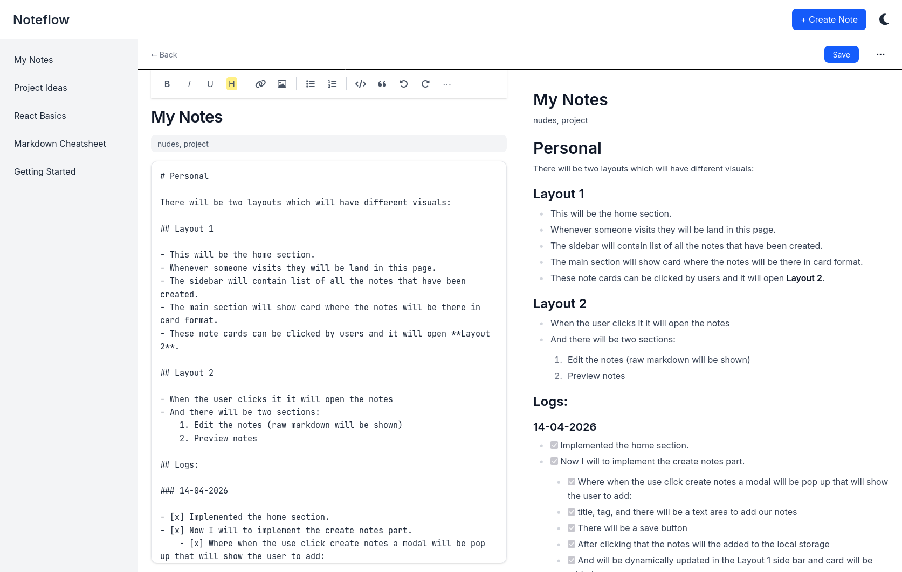
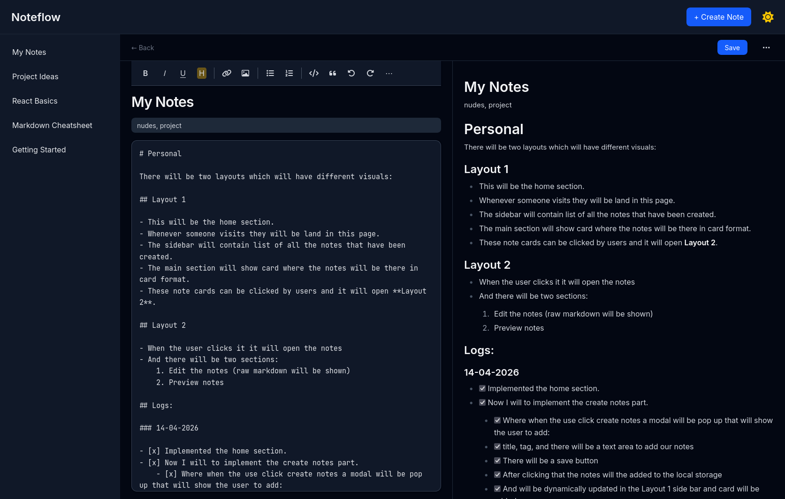
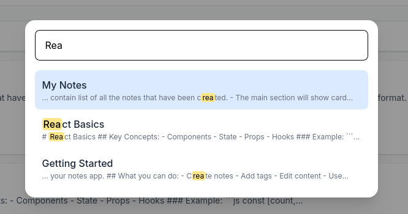

# NoteFlow

<p align="center">
  
</p>

<p align="center">
  <b>A modern, fast, and distraction-free markdown notes application built for productivity.</b>
</p>

---

## Overview

**NoteFlow** is a sleek and responsive markdown-based notes application designed to provide a clean writing experience with real-time preview support. It combines a modern UI with powerful note management features, making it ideal for students, developers, writers, and productivity enthusiasts.

The project focuses on:

- Fast and smooth user experience
- Live markdown editing and preview
- Beautiful dark/light mode support
- Persistent note storage
- Fully responsive design
- Productivity-focused keyboard shortcuts

---

## Features

### 📝 Markdown Editor

- Live markdown editing
- Real-time preview rendering
- Toolbar shortcuts for formatting
- Word wrap support
- Clean distraction-free interface

### 💾 Note Management

- Create, edit, and delete notes
- Auto-save functionality
- Notes stored locally for persistence
- Recently updated notes shown on top

### 🎨 User Experience

- Responsive layout for desktop and mobile
- Dark mode support
- Smooth UI interactions
- Split editor and preview layout

### 📄 Export Support

- Export notes as `.md` file
- Export notes as pdf (coming soon)

### ⌨️ Productivity Features

- Keyboard-friendly workflow
- Fast note searching

---

## Screenshots

<table>
  <tr>
    <td>
      
    </td>
    <td>
      
    </td>
  </tr>
  <tr>
    <td>
      
    </td>
    <td>
      
    </td>
  </tr>
</table>

---

## 🛠️ Tech Stack

| Technology      | Purpose                  |
| --------------- | ------------------------ |
| React           | Frontend UI Library      |
| Vite            | Development & Build Tool |
| Tailwind CSS    | Styling                  |
| JavaScript      | Core Logic               |
| Context API     | State Management         |
| Markdown Parser | Markdown Rendering       |

---

## Installation

### Clone the Repository

```bash
git clone https://github.com/your-username/noteflow.git
```

### Navigate to the Project Folder

```bash
cd noteflow
```

### Install Dependencies

```bash
npm install
```

### Start the Development Server

```bash
npm run dev
```

The application will run locally at:

```bash
http://localhost:5173
```

---

## 🤝 Contributing

Contributions are welcome!

If you'd like to contribute:

1. Fork the repository
2. Create a new feature branch
3. Commit your changes
4. Push the branch
5. Open a Pull Request

---

## Support

If you like this project, consider giving it a ⭐ on GitHub.

It helps support the project and motivates future development.
